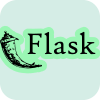

# 👋 Hey there! I'm **Soumyadip Adak**

I'm a passionate **Web Developer** with a deep love for coding, especially in **Java**. I am currently enhancing my skills in **Web Development** and **Python programming** to achieve my goal of becoming a **Full Stack Web Developer**.

## 🔗 About Me

- 🧑🏻‍🎓 **Student** | Lifelong Learner
- 📚 **Learning**: Web Development | Python Programming
- 💻 **Favorite Language**: Java
- 💬 **Ask Me About**: Java, Web Development
- 🎯 **Goal**: Full Stack Web Developer
- 🌍 **Fun Fact**: I love exploring new skills and traveling to new places.
- 📧 **Contact Me**: [work.soumyadipadak@gmail.com](mailto:work.soumyadipadak@gmail.com)

### 🌐 Connect with Me

    
    
    

## 🛠 I Code With

    
    
    
    
    
    

